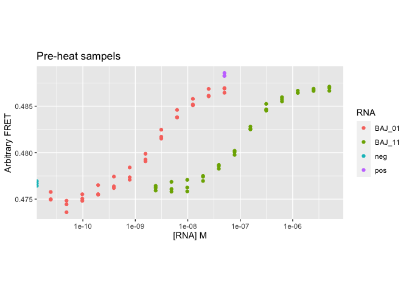
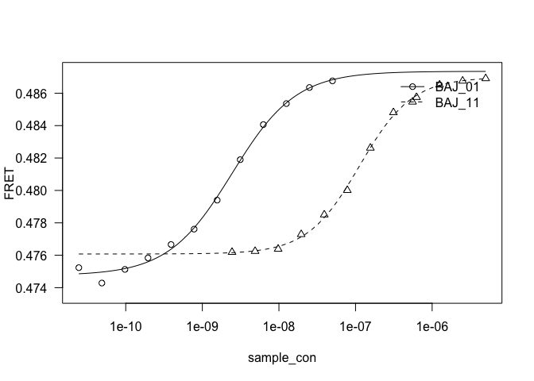
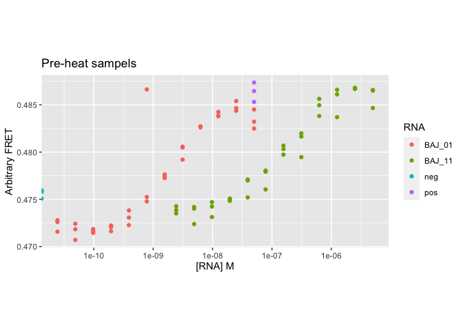
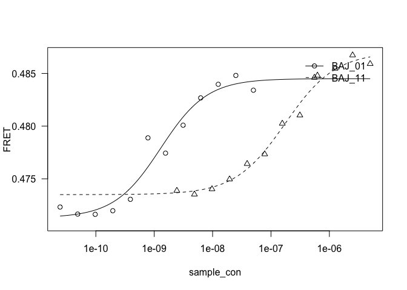
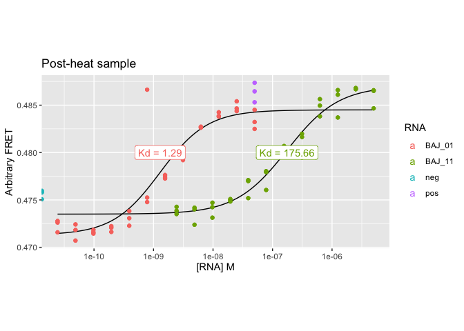
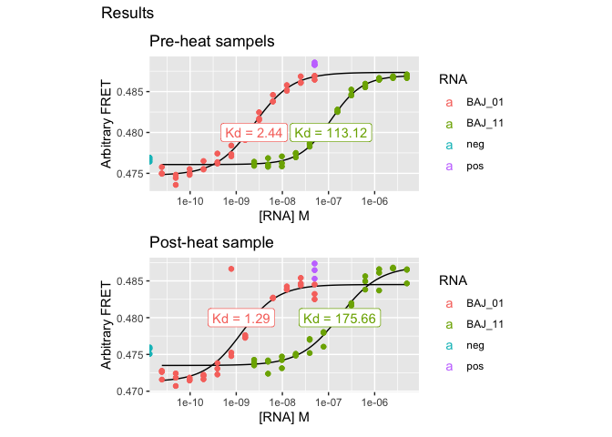
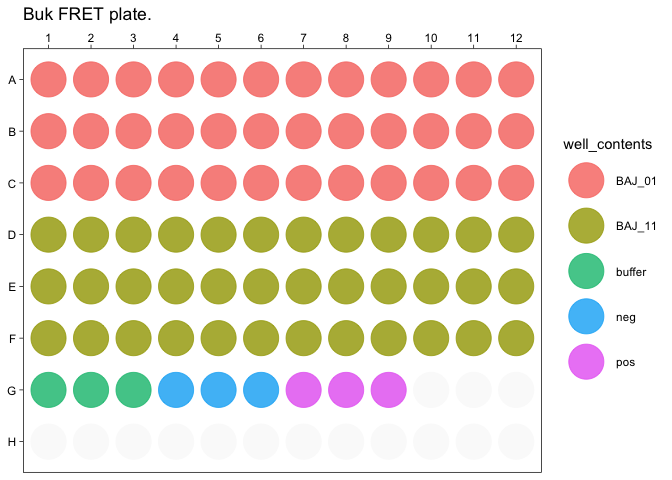

## Processing of bulk-FRET plates from the Typhoon imager.

The images were captured, and analysed using a custom macro in FIJI to aptured data from each of the 96 wells.

Data from FIJI was saved into .csv files, one line per well.


```r
path <- "~/Dropbox/BondLab/Data/Typhoon Images/200511/BAJ_01_11_preheat/image_data/"
pre.list <- list.files(path = path, pattern = ".csv", full.names = TRUE)
head(pre.list)
```

```
## [1] "/Users/brady/Dropbox/BondLab/Data/Typhoon Images/200511/BAJ_01_11_preheat/image_data//BAJ_01_11-Cy3-5.csv"
## [2] "/Users/brady/Dropbox/BondLab/Data/Typhoon Images/200511/BAJ_01_11_preheat/image_data//BAJ_01_11-Cy3.csv"  
## [3] "/Users/brady/Dropbox/BondLab/Data/Typhoon Images/200511/BAJ_01_11_preheat/image_data//BAJ_01_11-Cy5.csv"
```

```r
preheat_trans <- read.csv(file = pre.list[1])
preheat_trans <- preheat_trans[,c("Mean", "StdDev", "Mode", "Min", "Max", "Row", "Column")]
head(preheat_trans)
```

```
##       Mean  StdDev  Mode   Min   Max Row Column
## 1 40884.63 181.289 40910 40258 41504   A      1
## 2 41037.72 182.291 40960 40402 41395   A      2
## 3 41165.76 185.059 41092 40337 41564   A      3
## 4 40849.74 179.273 41001 40246 41269   A      4
## 5 40494.42 202.500 40665 39894 40847   A      5
## 6 40613.36 184.133 40745 39949 40939   A      6
```


```r
read_function <- function(file, specify_channel){
 
    
    tempdf <- read.csv(file = file)
    tempdf <- tempdf[,c("Mean", "StdDev", "Mode", "Min", "Max", "Row", "Column")]
    tempdf$channel <- specify_channel
    
    return(tempdf)
    
}

pre.cy3 <- read_function(pre.list[2], "Cy3")
pre.cy3$well <- paste(pre.cy3$Row, pre.cy3$Column, sep = "")
pre.trans <- read_function(pre.list[1], "trans")
```
## Going to try and develop some functions
Trying to make some functions for creating dataframes for plates (96 well to begin with). 

Need to be able to specify contents (particular RNA etc) but also relevant concentrations. These concentrations will be dilutd according to a particular ratio. Also need space for buffer, positive and negative controls.


```r
# rm(list = ls())

rowfill_conc <- function(max_conc, dil.factor = 0.5, num_dil = 12){
  max_conc * dil.factor^(0:(0+num_dil))
}

create_plate_properties <- function(row_range, column_range, max_conc, well_contents, dil.factor = 0.5, num_dil = 12){
  
  some_letters <- row_range

  row_let <- c("A")
  col_no <- c(1)
  sample_con <- c(10)
  sample_index <- c(1)

  index <- 0

  for(l in 1:length(some_letters)){
  
    conc <- rowfill_conc(max_conc, dil.factor = dil.factor, num_dil = num_dil)
  
    for(i in column_range){
      index <- index + 1

      row_let[index] <- some_letters[l]
      col_no[index] <- i
      sample_con[index] <- conc[i]
    }
  }

  some_df <- data.frame(
    row_let = row_let,
    col_no = col_no, 
    sample_con = sample_con,
    well_contents = well_contents
  )


  return(some_df)
}


head(create_plate_properties(row_range = LETTERS[4:6], column_range = 1:12, 10, "BAJ_01"))
```

```
##   row_let col_no sample_con well_contents
## 1       D      1    10.0000        BAJ_01
## 2       D      2     5.0000        BAJ_01
## 3       D      3     2.5000        BAJ_01
## 4       D      4     1.2500        BAJ_01
## 5       D      5     0.6250        BAJ_01
## 6       D      6     0.3125        BAJ_01
```

# Looks like we have some functions for generating dilutions

Should be usable for any combinations of rows / columns, including constants.


```r
sample_1 <- create_plate_properties(row_range = c("A", "B", "C"), column_range = 1:12, max_conc = 0.05e-6, well_contents = "BAJ_01")
sample_2 <- create_plate_properties(row_range = c("D", "E", "F"), column_range = 1:12, max_conc = 5e-6, well_contents = "BAJ_11")
buff <- create_plate_properties(row_range = "G", column_range = 1:3, max_conc = 0, well_contents = "buffer")
neg <- create_plate_properties(row_range = "G", column_range = 4:6, max_conc = 0, well_contents = "neg")
pos <- create_plate_properties(row_range = "G", column_range = 7:9, max_conc = 0.05e-6, well_contents = "pos", dil.factor = 1)

c.df <- do.call(what = rbind, args = list(sample_1, sample_2, buff, neg, pos))
c.df$identity <- paste(c.df$row_let, c.df$col_no, sep = "")
head(c.df)
```

```
##   row_let col_no sample_con well_contents identity
## 1       A      1 5.0000e-08        BAJ_01       A1
## 2       A      2 2.5000e-08        BAJ_01       A2
## 3       A      3 1.2500e-08        BAJ_01       A3
## 4       A      4 6.2500e-09        BAJ_01       A4
## 5       A      5 3.1250e-09        BAJ_01       A5
## 6       A      6 1.5625e-09        BAJ_01       A6
```
## Combine properties and values.
I have created all of the relevant properties for each of the wells. Now I need to apply these properties to actual readings.


```r
sample_wells <- pre.cy3$well %in% c.df$identity

pre_don_df <- cbind(pre.cy3[sample_wells,], c.df)
pre_trans_df <- cbind(pre.trans[sample_wells,], c.df)

# view(pre_don_df)

colnames(pre_don_df)
```

```
##  [1] "Mean"          "StdDev"        "Mode"          "Min"          
##  [5] "Max"           "Row"           "Column"        "channel"      
##  [9] "well"          "row_let"       "col_no"        "sample_con"   
## [13] "well_contents" "identity"
```

```r
pre_don_df <- pre_don_df[,colnames(pre_don_df)[c(1,2,3,4,5,8,9,10,11,12,13)]]
pre_trans_df <- pre_trans_df[,colnames(pre_trans_df)[c(1,2,3,4,5,8,9,10,11,12,13)]]
colnames(pre_don_df)
```

```
##  [1] "Mean"          "StdDev"        "Mode"          "Min"          
##  [5] "Max"           "channel"       "well"          "row_let"      
##  [9] "col_no"        "sample_con"    "well_contents"
```

```r
fret.df <- pre_don_df[,c("channel", "well", "row_let", "col_no", "sample_con", "well_contents")]
fret.df$FRET <- pre_trans_df$Mean / (pre_don_df$Mean + pre_trans_df$Mean)

pre_plot <- ggplot(fret.df %>% filter(well_contents != "buffer"), aes(sample_con, FRET, colour = well_contents)) + 
  geom_point() + 
  scale_x_log10() + 
  labs(title = "Pre-heat sampels", colour = "RNA", x = "[RNA] M", y = "Arbitrary FRET") + 
  theme(aspect.ratio = 1/2)
pre_plot
```

```
## Warning: Transformation introduced infinite values in continuous x-axis
```

<!-- -->


```r
pre_rna_only <- fret.df %>% filter(well_contents %in% c("BAJ_01", "BAJ_11"))

rna_list <- c("BAJ_01", "BAJ_11")

pre_drm <- drm(FRET~sample_con, curveid = well_contents, data = pre_rna_only, fct = LL.4())
pre_fit_curve <- plot(pre_drm)
```

<!-- -->

```r
colnames(pre_fit_curve) <- c("sample_con",rna_list)
m.pre_fit <- melt(pre_fit_curve, id.vars = c("sample_con"), variable.name = "well_contents", value.name = "FRET")

pre_values <- summary(pre_drm)

pre_label_df <- as.data.frame(pre_values$coefficients)[c(7,8),]
pre_label_df$well_contents <- rna_list


head(pre_label_df)
```

```
##              Estimate   Std. Error  t-value      p-value well_contents
## e:BAJ_01 2.444978e-09 1.806032e-10 13.53785 9.440257e-21        BAJ_01
## e:BAJ_11 1.131248e-07 6.950796e-09 16.27509 9.866618e-25        BAJ_11
```

```r
pre_results_plot <- pre_plot + 
  geom_line(data=m.pre_fit, colour="black", aes(group = well_contents)) + 
  geom_point() + 
  geom_label(data = pre_label_df, 
             aes(label = paste("Kd =",round(Estimate*1e9, 2)), 
                                      x = Estimate, 
                                      y = 0.48))
```
## Now onto the heat-treated.

I've got the data processed and plotted, and things are looking about right, as I expected them to. Now time to process this the heat-treated samples and compare the two.

I should probably make the remaining analysis into functions so I can call them in the future as well.


```r
heat.path <- "~/Dropbox/BondLab/Data/Typhoon Images/200511/BAJ_01_11_heated/image_data/"

heat.list <- list.files(path = heat.path, pattern = ".csv", full.names = TRUE)

head(heat.list)
```

```
## [1] "/Users/brady/Dropbox/BondLab/Data/Typhoon Images/200511/BAJ_01_11_heated/image_data//BAJ_01_11_heated_Cy3.csv"  
## [2] "/Users/brady/Dropbox/BondLab/Data/Typhoon Images/200511/BAJ_01_11_heated/image_data//BAJ_01_11_heated-Cy3-5.csv"
## [3] "/Users/brady/Dropbox/BondLab/Data/Typhoon Images/200511/BAJ_01_11_heated/image_data//BAJ_01_11_heated-Cy5.csv"
```

```r
heat.trans <- read_function(file = heat.list[2], specify_channel = "trans")
heat.trans$well <- paste(heat.trans$Row, heat.trans$Column, sep = "")
heat.cy3 <- read_function(file = heat.list[1], specify_channel = "cy3")
heat.cy3$well <- paste(heat.cy3$Row, heat.trans$Column, sep = "")
```

## Read in, now process as before.


```r
sample_wells <- heat.cy3$well %in% c.df$identity
# sample_wells
heat_don_df <- cbind(heat.cy3[sample_wells,], c.df)
heat_trans_df <- cbind(heat.trans[sample_wells,], c.df)

# # view(pre_don_df)

# colnames(pre_don_df)
# 
heat_don_df <- heat_don_df[,colnames(heat_don_df)[c(1,2,3,4,5,8,9,10,11,12,13)]]
heat_trans_df <- heat_trans_df[,colnames(heat_trans_df)[c(1,2,3,4,5,8,9,10,11,12,13)]]
colnames(heat_don_df)
```

```
##  [1] "Mean"          "StdDev"        "Mode"          "Min"          
##  [5] "Max"           "channel"       "well"          "row_let"      
##  [9] "col_no"        "sample_con"    "well_contents"
```

```r
# heat_don_df
# 
heat.fret.df <- heat_don_df[,c("channel", "well", "row_let", "col_no", "sample_con", "well_contents")]
heat.fret.df$FRET <- heat_trans_df$Mean / (heat_don_df$Mean + heat_trans_df$Mean)
# 
heat_plot <- ggplot(heat.fret.df %>% filter(well_contents != "buffer"), aes(sample_con, FRET, colour = well_contents)) +
  geom_point() +
  scale_x_log10() +
  labs(title = "Pre-heat sampels", colour = "RNA", x = "[RNA] M", y = "Arbitrary FRET") +
  theme(aspect.ratio = 1/2)
heat_plot
```

```
## Warning: Transformation introduced infinite values in continuous x-axis
```

<!-- -->

# calculate Kd and plot relevant data


```r
heat_rna_only <- heat.fret.df %>% filter(well_contents %in% c("BAJ_01", "BAJ_11"))
# 
rna_list <- c("BAJ_01", "BAJ_11")
# 
heat_drm <- drm(FRET~sample_con, curveid = well_contents, data = heat_rna_only, fct = LL.4())
heat_fit_curve <- plot(heat_drm)
```

<!-- -->

```r
colnames(heat_fit_curve) <- c("sample_con",rna_list)
m.heat_fit <- melt(heat_fit_curve, id.vars = c("sample_con"), variable.name = "well_contents", value.name = "FRET")
# 
heat_values <- summary(heat_drm)
# 
heat_label_df <- as.data.frame(heat_values$coefficients)[c(7,8),]
heat_label_df$well_contents <- rna_list
# 
# 
# head(pre_label_df)
# 
heat_results_plot <- heat_plot +
  labs(title = "Post-heat sample") +
  geom_line(data=m.heat_fit, colour="black", aes(group = well_contents)) +
  geom_point() +
  geom_label(data = heat_label_df,
             aes(label = paste("Kd =",round(Estimate*1e9, 2)),
                                      x = Estimate,
                                      y = 0.48))

heat_results_plot
```

```
## Warning: Transformation introduced infinite values in continuous x-axis

## Warning: Transformation introduced infinite values in continuous x-axis
```

<!-- -->

```r
pre_results_plot / heat_results_plot + plot_annotation(title = "Results")
```

```
## Warning: Transformation introduced infinite values in continuous x-axis

## Warning: Transformation introduced infinite values in continuous x-axis

## Warning: Transformation introduced infinite values in continuous x-axis

## Warning: Transformation introduced infinite values in continuous x-axis
```

<!-- -->

## Making a nice diagramatic plot

```r
head(heat.fret.df)
```

```
##   channel well row_let col_no sample_con well_contents      FRET
## 1     cy3   A1       A      1 5.0000e-08        BAJ_01 0.4845086
## 2     cy3   A2       A      2 2.5000e-08        BAJ_01 0.4843758
## 3     cy3   A3       A      3 1.2500e-08        BAJ_01 0.4837974
## 4     cy3   A4       A      4 6.2500e-09        BAJ_01 0.4826889
## 5     cy3   A5       A      5 3.1250e-09        BAJ_01 0.4805728
## 6     cy3   A6       A      6 1.5625e-09        BAJ_01 0.4772596
```

```r
heat.fret.df$row_let <- factor(x = heat.fret.df$row_let, levels = LETTERS[8:1], ordered = TRUE)

num_vec <- c()

for(i in 1:12){
  num_vec <- c((rep(i,8)), num_vec)
}
num_vec
```

```
##  [1] 12 12 12 12 12 12 12 12 11 11 11 11 11 11 11 11 10 10 10 10 10 10 10 10  9
## [26]  9  9  9  9  9  9  9  8  8  8  8  8  8  8  8  7  7  7  7  7  7  7  7  6  6
## [51]  6  6  6  6  6  6  5  5  5  5  5  5  5  5  4  4  4  4  4  4  4  4  3  3  3
## [76]  3  3  3  3  3  2  2  2  2  2  2  2  2  1  1  1  1  1  1  1  1
```

```r
points_df <- data.frame(
  let = rep(LETTERS[1:8], 12),
  num = num_vec
)

points_df$let <- factor(x = points_df$let, levels = LETTERS[8:1], ordered = TRUE)

ggplot(heat.fret.df, aes(as.factor(col_no), row_let, colour = well_contents)) + 
  geom_point(points_df, mapping = aes(x = num, y = let), colour = "grey98", size = 12) +
  geom_point(size = 12, aes(), alpha = 0.8) + 
  theme_linedraw() +
  scale_x_discrete(position = "top") +
  theme(panel.grid = element_blank(), 
        axis.title = element_blank()) +
  labs(title = "Buk FRET plate.", alpha = "")
```

<!-- -->

